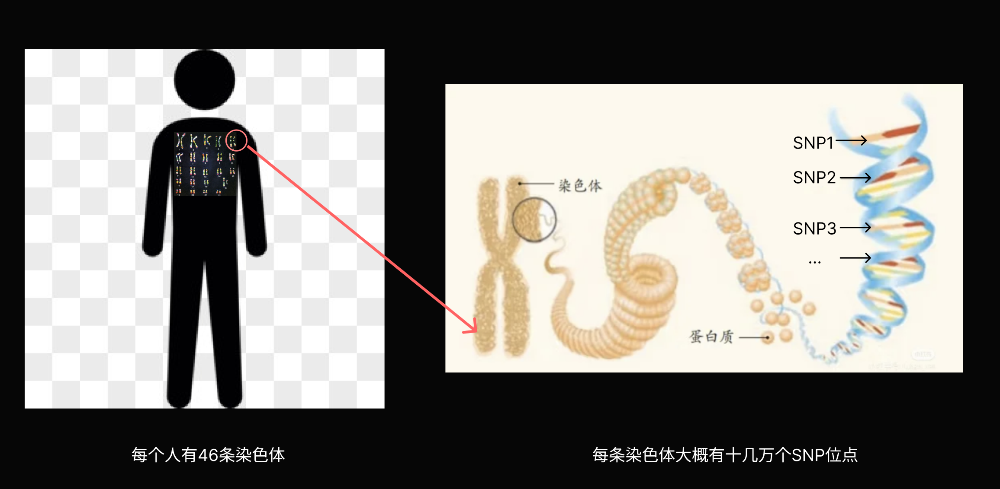
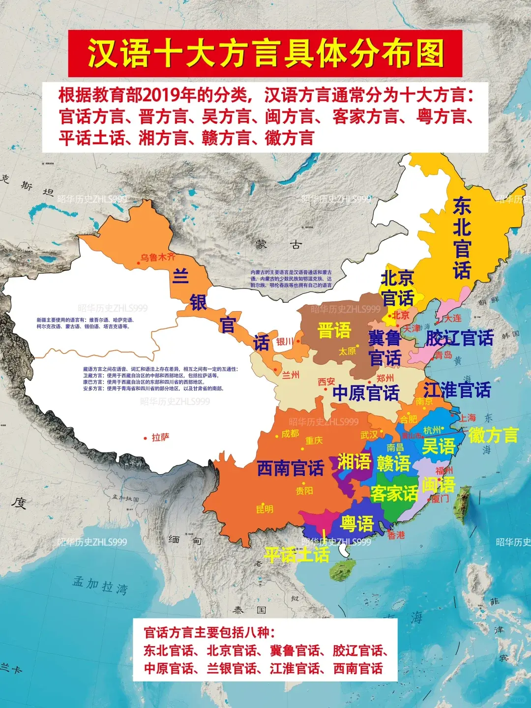

# 🧬 人类民族祖源基因分享大纲：我们体内的时空旅行

## 🎯 分享目标

### Q1：基因检测分析的是什么？

* **核心检测对象**：主要是 **SNP（单核苷酸多态性）**。
* **通俗解释**：

  * 人体有30亿个碱基对，99.9% 都是一样的。
  * 只有约 **0.1%** 的位点（几百万个）人与人不同，这些就是 SNP。
  * 消费级基因检测（如23魔方、微基因）通常只测这其中的 **60万-80万个位点**，就像是只检查书里的“错别字”或者“关键记号”，而不是把整本书（全基因组）都读一遍。
* **我们测的是什么？（常染色体 + 性染色体）**

  * **常染色体（Autosomes）**：这部分决定了你“像谁”，比如你有20%的北方汉族血统、10%的傣族血统。这部分基因每代都会打乱重组。
* **博主们都在聊什么？（Y染色体/线粒体）**

  * **Y染色体（父系）**：传男不传女。博主口中的“O系”、“R系”、“C系”就是这个。
  * **避坑指南**：Y染色体**只代表你的“姓氏”来源**，**不代表你的长相或血统比例**。
  * *例子*：一个Y染色体是欧洲类型（R系）的中国人，可能长得完全是亚洲人脸，因为 his 常染色体（决定长相的部分）经过几千年的稀释，已经完全是亚洲结构了。Y染色体只是一个“标签”。
* **去哪测？测了能干嘛？**

  * **机构**：
    * **国内**：23魔方（专注中国祖源）、微基因（WeGene，健康解读较多）。
    * **国际**：23andMe, AncestryDNA（虽然数据多，但对东亚人的细分不如国内机构准）。
  * **能获得什么？**
    * **祖源成分**：你是“纯北方人”还是“南北混血”？
    * **寻宗问祖**：你的父系祖先是当年打仗的将军，还是南下的移民？
    * **健康/体质风险**：酒精代谢能力、咖啡因敏感度、耳垢干湿、肌肉类型（爆发力还是耐力）。

### Q2：主流大众基因检测产品使用的是什么算法？（Admixture 为什么使用Admixture）

* **主流算法**：**Admixture** 及其变体。
* **为什么使用 Admixture？**
  * **成熟且直观**：它能把复杂的基因数据“翻译”成大众能看懂的百分比（如：20%北方汉族，80%南方汉族）。
  * **原理**：这是一种 **“监督学习”**。机构手里有一套“标杆人群库”（比如找了1000个纯正的山东人代表“北方汉族”）。系统把你的基因拿去和这些标杆比对，计算你像谁。
  * **局限性**：**结果完全依赖于标杆库**。如果标杆库里没有某个群体，算法就会强行把你归类到最像的已知群体里，产生“噪音”。
* **为什么不用更准的 G25？**
  * **门槛过高（用户体验）**：G25 给出的是 **25维的数学坐标**（一串数字），普通用户看不懂。用户喜欢的是 **“简单粗暴的故事”**（如：你有 20% 的皇室血统）。
  * **商业护城河**：Admixture 允许机构构建自己独家的 **“标杆库”**（比如某公司号称有独家的“客家人”标杆）。而 G25 是基于公开学术数据的通用坐标，机构很难通过它来建立商业壁垒。
  * **学术 vs 娱乐**：消费级基因检测本质上是 **“科学算命”** 和 **“社交货币”**，精准度不是第一位的，**“好玩”** 才是。G25 太硬核、太严肃，不适合发朋友圈。

### Q3：🔥 23魔方/微基因到底准不准？有更高级的玩法吗？

* **大家最关心的问题**：我花几百块测的祖源，是智商税吗？
* **答案一：它们准吗？**
  * **大方向准，小细节看运气**。
  * **准在哪里**：区分你是“北方汉族”还是“南方汉族”，或者有没有“日韩/东南亚”成分，通常非常准确，因为这些群体的基因差异足够大。
  * **不准在哪里**：微小的比例（如“1.2% 苗族”、“0.8% 韩国”）通常是**统计噪音**。这不代表你真有个苗族祖先，只是因为你的某些基因片段和苗族共享了更古老的祖源。
* **答案二：它们用什么算法？**
  * **主要是 Admixture 及其变体**。
  * **原理**：这是一种**“监督学习”**。机构手里有一套“标杆人群库”（比如找了1000个纯正的山东人代表“北方汉族”）。系统把你的基因拿去和这些标杆比对，计算你像谁。
  * **局限性**：**结果完全依赖于标杆库**。如果标杆库里没有“匈奴人”，系统就会强行把你归类到最像的“蒙古语族群”里，导致误判。
* **答案三：有没有更先进/精确的？为什么 G25 比 Admixture 更准？**
  * **进阶神器：G25 (Global25) / qpAdm**（学术界与高阶玩家首选）
    * **核心区别：坐标 vs 标签**
      * **Admixture** 像**“贴标签”**：它必须把你塞进预设的几个盒子里（如“北方汉族”、“蒙古族”）。如果你是独特的“混血儿”，它没法准确描述，只能强行把你拆碎了乱塞，导致出现奇怪的“噪音成分”（如 1% 越南）。
      * **G25** 像**“画坐标”**：它不预设盒子，而是直接给你一个**25维的数学坐标**。它不管你是谁，只是精确地标出你在人类基因地图上的位置。你离古人多远、离现代人多近，一目了然。
    * **优势**：
      * **更抗干扰**：G25 通过降维过滤掉了大量随机噪音，结果非常稳定。
      * **能算古人**：可以直接计算你和几千年前古墓遗骸的遗传距离（因为坐标系是通用的），而 Admixture 很难做到这一点。
  * **寻亲神器：IBD (Identity by Descent)**
    * **原理**：直接找**“完全相同的基因片段”**。
    * **优势**：这是目前最硬核的证据。不看概率，只看实锤。如果你的基因片段和另一个人长得一模一样，那你们绝对有共同祖先。这是比 Admixture 更精准的“认亲”方式。

### Q4：民族是基因概念吗？

* **答案**：**绝对不是**。
* **趣味解读**：
  * **“汉族”是雪球，不是石块**：汉族是一个巨大的**文化共同体**，而不是一的**血缘共同体**。就像滚雪球一样，在几千年的历史里，越滚越大，把周围的东夷、南蛮、西戎、北狄 do 卷进来了。
  * **历史证据**：
    * **鲜卑族的消失**：北魏孝文帝改革后，鲜卑族改汉姓、穿汉服，现在很多姓“元”、“长孙”、“宇文”、“穆”的人，祖上可能就是鲜卑贵族。
    * **五胡乱华与衣冠南渡**：北方的汉人跑到南方，和南方的百越民族融合；留下的北方汉人和草原民族融合。
  * **结论**：我们都是“混血儿”，汉族血统里流淌着整个东亚历史的融合史。
* **💡 知识拓展：东亚还有谁的内部差异这么大？**
  * **回族 (Hui)**：这是比汉族更极致的例子。
    * **基因真相**：各地的回族在基因上**高度接近当地的汉族**。比如山东回族和山东汉族很像，云南回族和云南汉族很像。
    * **共同点**：大家共享着少量的（约 5%-15%）**西欧亚（波斯/中亚）**成分，这是祖先沿丝绸之路留下的印记。
  * **越南京族 (Kinh)**：虽然属于东南亚，但在东亚文化圈内。
    * **南北差异**：北越人基因接近中国华南汉族（两广），南越人则融合了更多**占婆 (Champa)** 和 **高棉 (Khmer)** 的血统。
  * **蒙古族 (Mongol)**：草原上的差异也很大。
    * **内蒙 vs 外蒙**：
      * **内蒙蒙古族**：与北方汉族（尤其是山西、河北人）基因交流频繁，常染色体上差异较小。
      * **外蒙（喀尔喀蒙古）**：保留了更多**北亚/西伯利亚**成分（如古突厥、通古斯成分），汉族成分很少。
    * **西部蒙古（卫拉特/卡尔梅克）**：甚至带有一些中亚或西欧亚的特征。
    * **结论**：同一个“蒙古族”标签下，不同部落的血统成分可能天差地别。

### Q5：不同国家的人，基因有多大区别？

* **答案**：**微乎其微，甚至可以说是“几乎没有”**。
* **趣味解读**：
  * **99.9% 都是一样的**：随便抓一个中国人、一个尼日利亚人和一个挪威人，他们的基因相似度高达 **99.9%**。
  * **只有 0.1% 决定了“肤色”**：我们看到的黑皮肤、白皮肤、黄皮肤，仅仅是由那 **0.1%** 中极少量的基因开关决定的（主要是为了适应紫外线强弱）。
  * **反直觉的事实**：
    * 一个北京人和一个东京人的基因差异，可能比两个非洲部落之间的人的差异还要**小得多**。（因为人类走出非洲的时间很短，非洲以外的人类其实都是“近亲”，而非洲内部积累了更久的基因多样性）。
  * **结论**：在基因层面，种族主义是站不住脚的。

### Q6：科普补丁：关于基因的硬核常识（小白必看）

* **46条染色体**：就像**23双鞋子**，一半来自爸爸，一半来自妈妈。
  * 其中22双是“常染色体”（决定了你的大部分特征）。
  * 最后一双是“性染色体”（XX是女生，XY是男生）。
* **SNP（单核苷酸多态性）**：
  * 这是基因里的“错别字”或者“记号”，也是我们每个人**独一无二**的原因。
  * 人体大概有30亿个碱基对，但只有几百万个位点是不同的（SNP）。消费级基因检测通常只测这其中的**60万-80万个位点**。
* **碱基对（ATCG）**：生命天书的**4个字母**。
* **长什么样？占多大地方？**：
  * 如果你把全基因组打印出来，能填满几千本书。
  * 但在电脑里，你的核心基因数据（Raw Data）只是一个**20MB左右的文本文件**（txt或csv），里面密密麻麻写着 `rs12345 AG`, `rs67890 TT`。

### Q8：进阶玩家：Admixture 和 G25 坐标有什么区别？

* **Admixture (祖源成分计算)**:
  * *原理*：像把这杯水拆开，告诉你：20%橙汁，30%苹果汁，50%水。它是基于现有的“标杆人群”（Reference Panel）来计算的。
  * *优点*：直观，小白易懂（比如：你领到了“80%北方汉族”的卡片）。
  * *缺点*：依赖标杆。如果标杆里没有“匈奴人”，它就测不出你的匈奴血统，可能会把你强行归类到最近似的“蒙古人”里。容易出现“非父非母”的成分（噪音）。
* **G25 (Global 25 PCA Coordinates)**:
  * *原理*：把你变成坐标系里的一个点（25维空间）。计算你和古人/现代人坐标点的“距离”。
  * *优点*：非常硬核、精准。可以直接和几千年前的古墓遗骸（如田园洞人、仰韶文化古人）比对。不受商业机构预设标签的限制，是高阶玩家的神器。
  * *缺点*：门槛高，是一串数字，需要专门的计算器（如Vahaduo）来跑模型。

### Q9：穿越时空：古人和现代人的基因有区别吗？

* **答案**：**硬件没变，软件升级了**。
* **几千年来发生了什么**：
  * **自然选择在加速**：虽然我们长得和几千年前的古人差不多，但为了适应农业社会，我们进化出了：
    * **消化能力**：比如成年人喝牛奶不拉肚子（乳糖耐受），是最近几千年才普及的。消化淀粉的能力（AMY1基因）也增强了。
    * **免疫系统**：为了应对大规模聚集带来的瘟疫（天花、鼠疫），我们的免疫基因经过了残酷的筛选。
    * **外貌微调**：浅肤色、直发等特征在某些高纬度地区被强化。
  * **结论**：我们是古人的“优化版”，但核心代码（情感、智力潜能）基本没变。

### Q10：少数民族和汉族的基因一样吗？

* **答案**：**“你中有我，我中有你”的同心圆**。
* **趣味解读**：
  * **底层共性**：中国大地上的人群，无论民族，底层基因（Deep Ancestry）都是非常接近的，都是几万年前从东南亚/中亚迁徙进来的几大支系的后代。
  * **差异在边缘**：
    * **南方少数民族**（如壮族、苗族）：和南方汉族（尤其是广东人）基因重叠度非常高，甚至可以说是“保留了更多古百越特征的汉族亲戚”。
    * **北方少数民族**（如蒙古族）：和北方汉族基因交流频繁，但保留了更多北亚/西伯利亚的成分。
  * **文化 > 血统**：很多时候，区分汉族和少数民族的，是语言、习俗和认同感，而不是基因。一个改了汉姓的鲜卑人，过三代就是纯正汉族；一个汉族人入赘到苗寨，过三代就是纯正苗族。

### Q11：进化的代价：为什么广东人容易得地中海贫血？

* **现象**：在广东、广西等南方地区，很多人是“地贫基因携带者”（高达10%-20%），而在北方几乎没有。
* **原因**：**“那是祖先为了在疟疾中活下来，交的保护费”。**
  * **残酷博弈**：古代南方是瘴气之地，疟疾横行。疟原虫喜欢寄生在健康的红细胞里。拥有地贫基因的人，红细胞有点“缺陷”，疟原虫不喜欢住。
  * **结局**：正常人被疟疾淘汰了，携带者活了下来。
* **代价**：携带者通常只轻度贫血，但如果两个携带者结婚，孩子有25%概率患重度地贫。这是一场跨越千年的生物学悲剧与奇迹。

### Q12：人类基因还在进化吗？

* **答案**：**是的，而且从未停止，甚至在加速**。
* **趣味解读**：
  * **别被“现代文明”骗了**：虽然我们有了暖气和超市，但自然选择依然在悄悄工作。
  * **欧洲 vs 亚洲的“殊途同归”**：
    * **喝牛奶的能力（乳糖耐受）**：
      * **古代**：几千年前，无论是欧洲人还是亚洲人，成年后基本都喝不了牛奶（乳糖不耐受）。
      * **进化**：随着畜牧业的发展，**欧洲人**进化出了LCT基因突变，能消化牛奶。有趣的是，**东亚**和**非洲**的牧民群体也独立进化出了类似的能力，但**基因突变点完全不同**！这是典型的“趋同进化”。
    * **肤色变浅**：
      * **欧洲**：古欧洲人（如中石器时代猎人）其实很多是**黑皮肤、蓝眼睛**。现在的白皮肤是后来为了在低日照下合成维生素D而进化出来的（主要涉及SLC24A5等基因）。
      * **亚洲**：东亚人的浅肤色也是独立进化出来的，涉及的基因（如OCA2的特定突变）与欧洲人**并不一样**。所以，我们变白不是“变成白人”，而是“变成了浅肤色的东亚人”。
  * **现在的进化**：现在的环境（如高糖饮食、新型病毒）正在挑选适应它们的基因。也许几千年后，人类会普遍拥有“抗糖尿病”或“抗艾滋病”的基因。
  * **硬核实战：用 G25 距离看“变了多少”**
    * **原理**：G25 距离越小，说明越像。
      * **< 0.02**：亲密老乡（如河南人 vs 山东人）。
      * **> 0.05**：明显不同（如中国人 vs 越南人）。
      * **> 0.10**：完全不同种族（如中国人 vs 英国人）。
    * **欧洲的剧变（万年尺度：换血式融合）**：
      * **古人**：英国的“切达人”（Cheddar Man，1万年前，黑皮肤蓝眼睛）。
      * **现代人**：现代英国人（白皮肤）。
      * **G25距离**：**约 0.12**（极大，相当于跨人种）。
      * **结论**：**“鸠占鹊巢”**。现代欧洲人只保留了 10% 左右的切达人血统，剩下的 90% 都是后来涌入的安纳托利亚农民和草原牧民。基本上是换了一拨人。
    * **东亚的连续（万年尺度：内部重组）**：
      * **古人**：山东的“扁扁洞人”（约9500年前，古北方人代表）。
      * **现代人**：现代山东人。
      * **G25距离**：**约 0.04**（有差异，但在同一族群范畴内）。
      * **结论**：**“血脉相连”**。虽然有 0.04 的距离，但这主要是因为几千年来发生了**“南北大融合”**（现代山东人混合了部分古南方成分），而不是被外来人种清洗。相比欧洲，我们的基因连续性是世界罕见的。我们依然是万年前这片土地主人的直系后代。

### Q13：亲子鉴定到底要花多少钱？怎么选才不坑？

* **答案**：**不是几百块就能搞定，通常在 2000-5000 元之间，关键看用途**。
* **避坑指南 & 价格揭秘**：
  * **💰 只要法律效力（上户口、打官司、移民）** -> **选“司法亲子鉴定”**
    * **特点**：这是上户口的“硬通货”，必须**本人到场**，现场拍照、按指纹，过程严谨。
    * **价格**：**2400-3600元**（父子），若是父母子三人约 **3000-5000元**。
    * **注意**：认准司法局官网可查、有 CMA/CNAS 认证的正规机构。报告有效期通常为 3 个月。
  * **🤫 只有自己知道（私下了解）** -> **选“个人隐私亲子鉴定”**
    * **特点**：**全程保密**，不需要到场。可以自己采集样本（头发、口腔拭子）寄给机构。
    * **价格**：**2000-2400元**。
    * **警告**：这种报告**没有法律效力**，不能用来上户口！切记不要被低价吸引后的“二次收费”坑了。
  * **🤰 孕期想确认（产前鉴定）** -> **选“无创胎儿亲子鉴定”**
    * **特点**：孕 5-6 周以上，抽妈妈静脉血（提取胎儿游离 DNA），**安全无创**。
    * **价格**：技术复杂，最贵，约 **4000-4500元**。
* **技术补充**：
  * 虽然价格不菲，但技术原理依然是比对 **STR（短串联重复序列）**，不需要测全基因组（30亿个碱基对）。
  * **特殊情况**：
    * **加急**：常规 5-7 天出结果，加急（3天内）通常需额外加 500-1500 元。
    * **隔代/同胞鉴定**：如果父亲不在，测 **Y染色体**（找爷爷）或 **线粒体**（找同母异父手足），性价比高。

### Q14：祖源计算（G25/Admixture）和AI算法是一回事吗？

* **答案**：**是的，它们本质上是“亲兄弟”，都是数学上的降维和聚类算法**。
* **趣味解读**：
  * **Admixture ≈ 文本分析（Topic Modeling）**：
    * **AI怎么做**：给AI一篇文章，它会分析出“这篇文章 30% 是关于科技，70% 是关于体育”。
    * **Admixture怎么做**：给算法你的基因，它会分析出“你的基因 20% 来自北方汉族，80% 来自南方汉族”。
    * **本质**：它们都在做**“成分拆解”**（通常是基于概率的混合模型，如LDA）。
  * **G25 (PCA) ≈ 词向量（Word Embeddings）**：
    * **AI怎么做**：ChatGPT 把“苹果”这个词变成一串数字坐标 `[0.1, 0.5, -0.3...]`，让它在数学空间里离“香蕉”很近，离“汽车”很远。
    * **G25怎么做**：把“你”变成一个 25 维的坐标 `[0.02, -0.4, ...]`。
    * **神奇之处**：在这个数学空间里，你和你的老乡距离很近，和外国人距离很远。你可以直接用几何距离（如欧氏距离）计算你和 5000 年前的古人有多像。
* **追问：那 G25 算是一个“小的 AI 模型”吗？**
  * **完全可以这么理解！**
  * **它是“无监督学习”**：在 AI 领域，G25 所用的 PCA（主成分分析）不仅是基础工具，本身就是一种经典的**机器学习模型**。
  * **它在做什么**：它把几十万个杂乱的基因位点（大数据），通过数学运算，自动压缩成了 25 个“精华特征”。这就好比 AI 看了几万张照片后，自动学会了提取“眼睛、鼻子、耳朵”这些关键特征。虽然它没有 ChatGPT 那么庞大的神经网络，但它确实是在用机器的逻辑帮人类**“提炼规律”**。
* **总结**：生物学家用来分析祖源的工具，其实和计算机科学家用来训练 AI 的数学工具（矩阵分解、降维算法）是完全通用的。你的基因数据，本质上就是大数据。

### Q15：到底是什么决定了你的基因特色？是长相？是省份？

* **答案**：**都不是，最严格来说是“方言区”**。
* **趣味解读**：
  * **长相只是表象**：长相只是极小一部分基因的线性表达。
  * **回归平均**：只要没有近期的混血，一个人的基因几乎**百分百**会和当地人群的**基因平均数**无限接近。
  * **为什么是方言区？**
    * **方言即隔离**：在古代，方言区往往对应着地理隔离（山川河流），这同时也阻隔了基因的自由流动。
    * **省份的“伪装”**：中国的省份划分往往故意**横跨方言区**（犬牙交错），利于中央制衡管理。
      * *典型例子*：**广东**（广府 vs 潮汕）、**江苏**（苏南 vs 苏北）。同一个省的人，基因可能分属完全不同的阵营。
    * **结论**：方言区往往能最精准地对应基因簇（Genetic Cluster），比行政省份更靠谱。

### Q16：最后一步：如何给自己做基因检测？（实操指南）

* **第一步：获取你的基因数据（Raw Data）**
  * **推荐机构**：**微基因 (WeGene)**
  * **理由**：对中国人的位点优化较好，且允许用户下载完整的原始数据（Raw Data）。
  * **购买链接**：[微基因官网](https://www.wegene.com/)
  * **操作**：购买标准版（或全基因组版） -> 唾液采集 -> 寄回 -> 等待报告 -> 在官网“设置”或“数据”页面下载 `txt` 格式的原始数据。
* **第二步：将数据转换为 G25 坐标**
  * 你拿到的 Raw Data 是几百兆的乱码天书，需要转换成 25维坐标。
  * **方式一：IllustrativeDNA（推荐，付费）**

    * **网址**：[https://illustrativedna.com/](https://illustrativedna.com/)
    * **特点**：上传 Raw Data，支付约 27 欧元。它不仅给你 G25 坐标，还直接提供一套非常精美的古代祖源分析报告（如：你的基因里有多少猎人、多少农民）。
* **第三步：开始探索**
  * 拿到坐标后（一串数字），你就可以去 **Vahaduo**（在线计算器）或者使用各种 G25 分析工具，开启你的“基因考古”之旅了。
