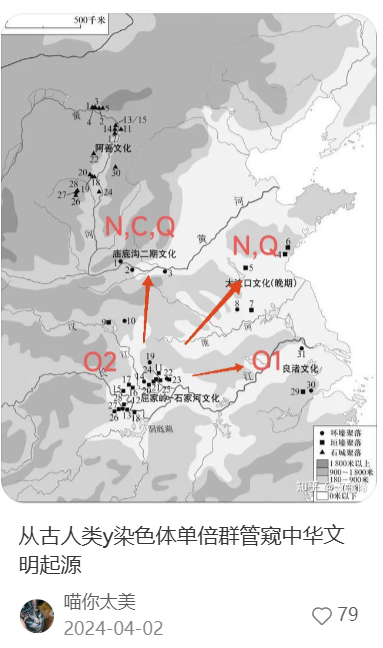
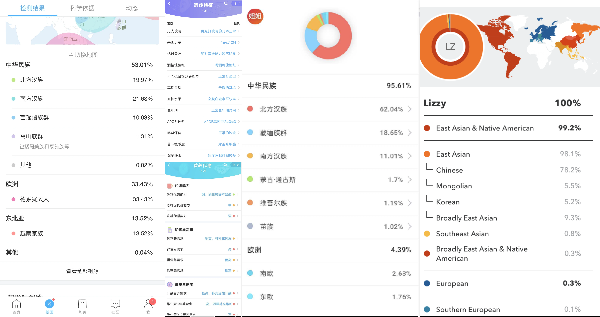
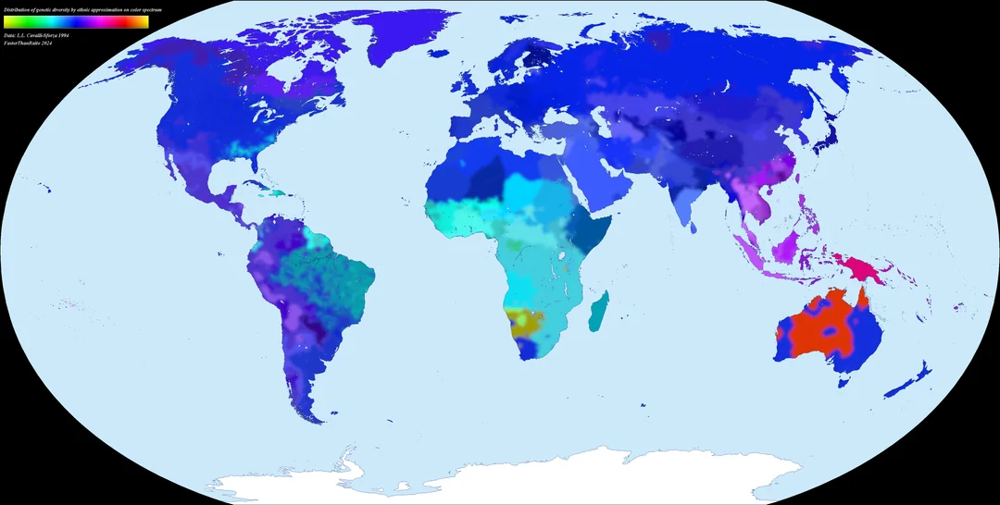
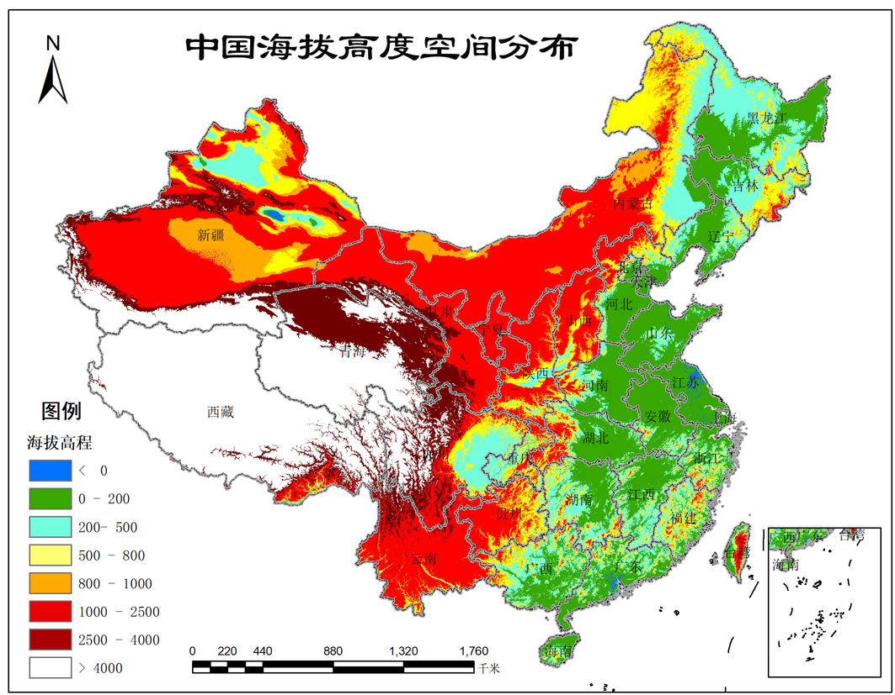

# 🧬 人类民族祖源基因分享大纲：我们体内的时空旅行

## Q0 ：基因检测分析的是什么？

* **核心检测对象**：主要是 **SNP（单核苷酸多态性）**。
* **通俗解释**：

  * 人体有30亿个碱基对，99.9% 都是一样的。
  * 只有约 **0.1%** 的位点（几百万个）人与人不同，这些就是 SNP。
  * 消费级基因检测（如23魔方、微基因）通常只测这其中的 **60万-80万个位点**，就像是只检查书里的“错别字”或者“关键记号”，而不是把整本书（全基因组）都读一遍。
* **我们分析的是什么？（常染色体 + 性染色体）**

  * **常染色体（Autosomes）**：这部分决定了你“像谁”，比如你有20%的北方汉族血统、10%的傣族血统。这部分基因每代都会打乱重组。
* 
* **博主们都在聊什么？（Y染色体/线粒体）

  **

  * **Y染色体（父系）**：传男不传女。博主口中的“O系”、“R系”、“C系”就是这个。
  * **避坑指南**：Y染色体**只代表你的“姓氏”来源**，**不代表你的长相或血统比例**。
  * *例子*：一个Y染色体是欧洲类型（R系）的中国人，可能长得完全是亚洲人脸，因为 his 常染色体（决定长相的部分）经过几千年的稀释，已经完全是亚洲结构了。Y染色体只是一个“标签”。
* **去哪测？测了能干嘛？**

  * **机构**：
    * **国内**：23魔方（专注中国祖源）、微基因（WeGene，健康解读较多）。
    * **国际**：23andMe, AncestryDNA（虽然数据多，但对东亚人的细分不如国内机构准）。
  * **能获得什么？**
    * 一份个人的原始dna文件
  * * **祖源成分**：你是“纯北方人”还是“南北混血”？
    * **健康/体质风险**：酒精代谢能力、咖啡因敏感度、耳垢干湿、肌肉类型（爆发力还是耐力）。
    * **医疗用途**：还可以用于医疗，但这通常需要**全基因组测序**。
      * *硬核举例*：
        * **单基因遗传病**：如**地中海贫血**、**脊髓性肌萎缩症 (SMA)**、**亨廷顿舞蹈症**。
        * **癌症风险**：著名的 **BRCA1/2 基因**（安吉丽娜·朱莉同款），携带者患乳腺癌/卵巢癌风险极高。
        * **药物代谢**：比如你吃**华法林**（抗凝药）或者**叶酸**需要多大剂量，基因说了算。
        * **靶向药指导**：癌症患者必做。比如肺癌测 **EGFR** 突变，有这个突变吃“易瑞沙”才有效，否则就是吃毒药。

## Q1 结果长什么样？

## Q2：主流大众基因检测产品的算法与准确性

结果准确可信吗？

* **相对准**。但只能根据你的结果确定你属于哪个地区（华北东北，西南，西北，东南）
* 为啥准？

  * **主流算法**：**Admixture** 及其变体。
* 
* **Admixture 报告示例**（通俗易懂）：

  > 您的祖源成分：
  > 🟧 **北方汉族**：52.4%
  > 🟦 **南方汉族**：38.1%
  > 🟩 日本：5.2%
  > 🟪 **苗瑶语族**：4.3%
  >

  * 
  * **主要是 Admixture 及其变体**。
  * **原理**：这是一种**“监督学习”**。机构手里有一套“标杆人群库”（比如找了1000个纯正的山东人代表“北方汉族”）。系统把你的基因拿去和这些标杆比对，计算你像谁。
  * **局限性**：**结果完全依赖于标杆库**。如果标杆库里没有“匈奴人”，系统就会强行把你归类到最像的“蒙古语族群”里，导致误判。
* **有没有更先进/精确的？为什么 G25 比 Admixture 更准？**

  **G25 坐标示例**（硬核数据）：

  > `User_Scaled,0.0216,-0.4501,0.0123,-0.0654,0.0231,0.0112,0.0045,-0.0021,-0.0123,0.0056...`
  > *(这是一组25个数学坐标，代表了你在全人类基因主成分分析图上的精确位置)*
  >

  * **出处与作者**：由国外知名基因博主 **Davidski**（Eurogenes 博客的博主）开发。
  * **国外应用程度**：在国际分子人类学社区（如 Anthrogenica）被奉为**“黄金标准”**。它是目前全球高阶玩家进行 DIY 祖源分析的通用语言，几乎所有的第三方分析工具（如 Vahaduo, Genoplot）都基于 G25 坐标体系。
  * **进阶神器：G25 (Global25) / qpAdm**（学术界与高阶玩家首选）
    * **核心区别：坐标 vs 标签**
      * **Admixture** 像**“贴标签”**：它必须把你塞进预设的几个盒子里（如“北方汉族”、“蒙古族”）。如果你是独特的“混血儿”，它没法准确描述，只能强行把你拆碎了乱塞，导致出现奇怪的“噪音成分”（如 1% 越南）。
      * **G25** 像**“画坐标”**：它不预设盒子，而是直接给你一个**25维的数学坐标**。它不管你是谁，只是精确地标出你在人类基因地图上的位置。你离古人多远、离现代人多近，一目了然。
    * **优势**：
      * **更抗干扰**：G25 通过降维过滤掉了大量随机噪音，结果非常稳定。
      * **能算古人**：可以直接计算你和几千年前古墓遗骸的遗传距离（因为坐标系是通用的），而 Admixture 很难做到这一点。

所以 本质上来说 上述厂商给的是一份个人基因数据文件和 一种基于Admixture的结果

* **Admixture 原理一句话总结**：

  > 这是一种**“按图索骥”**的**监督学习**——系统将你的基因与预设的**“标杆人群库”**（如纯正北方汉族样本）进行比对，计算出你属于各个标杆的**百分比**；因此结果**直观易懂**，但完全**依赖标杆库的覆盖度**（若标杆缺失，则会产生强行归类的“噪音”）。
  >
* **为什么不用更准的 G25？**

  * **门槛过高（用户体验）**：G25 给出的是 **25维的数学坐标**（一串数字），普通用户看不懂。用户喜欢的是 **“简单粗暴的故事”**（如：你有 20% 的皇室血统）。
  * **商业护城河**：Admixture 允许机构构建自己独家的 **“标杆库”**（比如某公司号称有独家的“客家人”标杆）。而 G25 是基于公开学术数据的通用坐标，机构很难通过它来建立商业壁垒。
  * **学术 vs 娱乐**：消费级基因检测本质上是 **“科学算命”** 和 **“社交货币”**，精准度不是第一位的，**“好玩”** 才是。G25 太硬核、太严肃，不适合发朋友圈。

## Q3 ：民族是基因概念吗？

世界基因距离地图

世界民族地图

* **答案**：**不是**。民族更多是一种文化、政治概念
* 
* * **“汉族”是雪球，还是铁板一块？**
  * **教科书里的传说**：我们常说汉族像滚雪球，把周边的东夷、南蛮、西戎、北狄都卷进来了。**但这仅仅是文化的融合，还是血统的真实写照？**
  * **历史留下的疑问**：
    * **鲜卑人真的消失了吗？** 北魏孝文帝一声令下，鲜卑皇族改姓“元”，贵族改姓“长孙”、“宇文”。**这些曾经的草原霸主，是真的彻底融入了北方汉族的血脉，还是在历史长河中被悄悄替换了？**
    * **衣冠南渡是真的吗？** 史书上说北方世家大族逃往江南。**那今天的南方人，到底是纯正的中原后裔，还是仅仅保留了语言文化的南方土著？**
  * **灵魂拷问**：**我们常挂在嘴边的“炎黄子孙”，到底是一个血缘事实，还是一场持续千年的文化认同？**
* 
* 但我们今天不讲历史和传说 这是2026年了 用最先进的工具来 探知事实到底如何
* **💡 知识拓展：东亚还有谁的内部差异这么大？**

  * **越南京族 (Kinh)**：虽然属于东南亚，但在东亚文化圈内。
    * **南北差异**：北越人基因接近中国华南汉族（两广），南越人则融合了更多**占婆 (Champa)** 和 **高棉 (Khmer)** 的血统。
  * **蒙古族 (Mongol)**：草原上的差异也很大。
    * **内蒙 vs 外蒙**：
      * **内蒙蒙古族**：与北方汉族（尤其是山西、河北人）基因交流频繁，常染色体上差异较小。
      * **外蒙（喀尔喀蒙古）**：保留了更多**北亚/西伯利亚**成分（如古突厥、通古斯成分），汉族成分很少。
    * **西部蒙古（卫拉特/卡尔梅克）**：甚至带有一些中亚或西欧亚的特征。
    * **结论**：同一个“蒙古族”标签下，不同部落的血统成分可能天差地别。

## Q4 ：科普补丁：关于基因的硬核常识（小白必看）

* **46条染色体**：就像**23双鞋子**，一半来自爸爸，一半来自妈妈。
  * 其中22双是“常染色体”（决定了你的大部分特征）。
  * 最后一双是“性染色体”（XX是女生，XY是男生）。
* **SNP（单核苷酸多态性）**：
  * 这是基因里的“错别字”或者“记号”，也是我们每个人**独一无二**的原因。
  * 人体大概有30亿个碱基对，但只有几百万个位点是不同的（SNP）。消费级基因检测通常只测这其中的**60万-80万个位点**。
* **碱基对（ATCG）**：生命天书的**4个字母**。
* **长什么样？占多大地方？**：
  * 如果你把全基因组打印出来，能填满几千本书。
  * 但在电脑里，你的核心基因数据（Raw Data）只是一个**20MB左右的文本文件**（txt或csv），里面密密麻麻写着 `rs12345 AG`, `rs67890 TT`。

## Q5 ：进阶玩家：Admixture 和 G25 坐标有什么区别？

* **Admixture (祖源成分计算)**:
  * *原理*：像把这杯水拆开，告诉你：20%橙汁，30%苹果汁，50%水。它是基于现有的“标杆人群”（Reference Panel）来计算的。
  * *优点*：直观，小白易懂（比如：你领到了“80%北方汉族”的卡片）。
  * *缺点*：依赖标杆。如果标杆里没有“匈奴人”，它就测不出你的匈奴血统，可能会把你强行归类到最近似的“蒙古人”里。容易出现“非父非母”的成分（噪音）。
* **G25 (Global 25 PCA Coordinates)**:
  * *原理*：把你变成坐标系里的一个点（25维空间）。计算你和古人/现代人坐标点的“距离”。
  * *优点*：非常硬核、精准。可以直接和几千年前的古墓遗骸（如田园洞人、仰韶文化古人）比对。不受商业机构预设标签的限制，是高阶玩家的神器。
  * *缺点*：门槛高，是一串数字，需要专门的计算器（如Vahaduo）来跑模型。

## Q6 ：穿越时空：古人和现代人的基因有区别吗？

* **答案**：**硬件没变，软件升级了**。
* **几千年来发生了什么**：
  * **自然选择在加速**：虽然我们长得和几千年前的古人差不多，但为了适应农业社会，我们进化出了：
    * **消化能力**：比如成年人喝牛奶不拉肚子（乳糖耐受），是最近几千年才普及的。消化淀粉的能力（AMY1基因）也增强了。
    * **免疫系统**：为了应对大规模聚集带来的瘟疫（天花、鼠疫），我们的免疫基因经过了残酷的筛选。
    * **外貌微调**：浅肤色、直发等特征在某些高纬度地区被强化。
  * **结论**：我们是古人的“优化版”，但核心代码（情感、智力潜能）基本没变。

## Q7 ：少数民族和汉族的基因一样吗？

* **答案**：**“你中有我，我中有你”的同心圆**。
* **趣味解读**：
  * **底层共性**：中国大地上的人群，无论民族，底层基因（Deep Ancestry）都是非常接近的，都是几万年前从东南亚/中亚迁徙进来的几大支系的后代。
  * **差异在边缘**：
    * **南方少数民族**（如壮族、苗族）：和南方汉族（尤其是广东人）基因重叠度非常高，甚至可以说是“保留了更多古百越特征的汉族亲戚”。
    * **北方少数民族**（如蒙古族）：和北方汉族基因交流频繁，但保留了更多北亚/西伯利亚的成分。
  * **文化 > 血统**：很多时候，区分汉族和少数民族的，是语言、习俗和认同感，而不是基因。一个改了汉姓的鲜卑人，过三代就是纯正汉族；一个汉族人入赘到苗寨，过三代就是纯正苗族。

## Q8 ：进化的代价：为什么广东人容易得地中海贫血？

* **现象**：在广东、广西等南方地区，很多人是“地贫基因携带者”（高达10%-20%），而在北方几乎没有。
* **原因**：**“那是祖先为了在疟疾中活下来，交的保护费”。**
  * **残酷博弈**：古代南方是瘴气之地，疟疾横行。疟原虫喜欢寄生在健康的红细胞里。拥有地贫基因的人，红细胞有点“缺陷”，疟原虫不喜欢住。
  * **结局**：正常人被疟疾淘汰了，携带者活了下来。
* **代价**：携带者通常只轻度贫血，但如果两个携带者结婚，孩子有25%概率患重度地贫。这是一场跨越千年的生物学悲剧与奇迹。

## Q9 ：人类基因还在进化吗？

* **答案**：**是的，而且从未停止，甚至在加速**。
* **趣味解读**：
  * **别被“现代文明”骗了**：虽然我们有了暖气和超市，但自然选择依然在悄悄工作。
  * **欧洲 vs 亚洲的“殊途同归”**：
    * **喝牛奶的能力（乳糖耐受）**：
      * **古代**：几千年前，无论是欧洲人还是亚洲人，成年后基本都喝不了牛奶（乳糖不耐受）。
      * **进化**：随着畜牧业的发展，**欧洲人**进化出了LCT基因突变，能消化牛奶。有趣的是，**东亚**和**非洲**的牧民群体也独立进化出了类似的能力，但**基因突变点完全不同**！这是典型的“趋同进化”。
    * **肤色变浅**：
      * **欧洲**：古欧洲人（如中石器时代猎人）其实很多是**黑皮肤、蓝眼睛**。现在的白皮肤是后来为了在低日照下合成维生素D而进化出来的（主要涉及SLC24A5等基因）。
      * **亚洲**：东亚人的浅肤色也是独立进化出来的，涉及的基因（如OCA2的特定突变）与欧洲人**并不一样**。所以，我们变白不是“变成白人”，而是“变成了浅肤色的东亚人”。
  * **现在的进化**：现在的环境（如高糖饮食、新型病毒）正在挑选适应它们的基因。也许几千年后，人类会普遍拥有“抗糖尿病”或“抗艾滋病”的基因。
  * **硬核实战：用 G25 距离看“变了多少”**
    * **原理**：G25 距离越小，说明越像。
      * **< 0.02**：亲密老乡（如河南人 vs 山东人）。
      * **> 0.05**：明显不同（如中国人 vs 越南人）。
      * **> 0.10**：完全不同种族（如中国人 vs 英国人）。
    * **欧洲的剧变（万年尺度：换血式融合）**：
      * **古人**：英国的“切达人”（Cheddar Man，1万年前，黑皮肤蓝眼睛）。
      * **现代人**：现代英国人（白皮肤）。
      * **G25距离**：**约 0.12**（极大，相当于跨人种）。
      * **结论**：**“鸠占鹊巢”**。现代欧洲人只保留了 10% 左右的切达人血统，剩下的 90% 都是后来涌入的安纳托利亚农民和草原牧民。基本上是换了一拨人。
    * **东亚的连续（万年尺度：内部重组）**：
      * **古人**：山东的“扁扁洞人”（约9500年前，古北方人代表）。
      * **现代人**：现代山东人。
      * **G25距离**：**约 0.04**（有差异，但在同一族群范畴内）。
      * **结论**：**“血脉相连”**。虽然有 0.04 的距离，但这主要是因为几千年来发生了**“南北大融合”**（现代山东人混合了部分古南方成分），而不是被外来人种清洗。相比欧洲，我们的基因连续性是世界罕见的。我们依然是万年前这片土地主人的直系后代。

## Q10 ：亲子鉴定到底要花多少钱？怎么选才不坑？

* **答案**：**不是几百块就能搞定，通常在 2000-5000 元之间，关键看用途**。
* **避坑指南 & 价格揭秘**：
  * **💰 只要法律效力（上户口、打官司、移民）** -> **选“司法亲子鉴定”**
    * **特点**：这是上户口的“硬通货”，必须**本人到场**，现场拍照、按指纹，过程严谨。
    * **价格**：**2400-3600元**（父子），若是父母子三人约 **3000-5000元**。
    * **注意**：认准司法局官网可查、有 CMA/CNAS 认证的正规机构。报告有效期通常为 3 个月。
  * **🤫 只有自己知道（私下了解）** -> **选“个人隐私亲子鉴定”**
    * **特点**：**全程保密**，不需要到场。可以自己采集样本（头发、口腔拭子）寄给机构。
    * **价格**：**2000-2400元**。
    * **警告**：这种报告**没有法律效力**，不能用来上户口！切记不要被低价吸引后的“二次收费”坑了。
  * **🤰 孕期想确认（产前鉴定）** -> **选“无创胎儿亲子鉴定”**
    * **特点**：孕 5-6 周以上，抽妈妈静脉血（提取胎儿游离 DNA），**安全无创**。
    * **价格**：技术复杂，最贵，约 **4000-4500元**。
* **技术补充**：
  * 虽然价格不菲，但技术原理依然是比对 **STR（短串联重复序列）**，不需要测全基因组（30亿个碱基对）。
  * **特殊情况**：
    * **加急**：常规 5-7 天出结果，加急（3天内）通常需额外加 500-1500 元。
    * **隔代/同胞鉴定**：如果父亲不在，测 **Y染色体**（找爷爷）或 **线粒体**（找同母异父手足），性价比高。

## Q11 ：祖源计算（G25/Admixture）和AI算法是一回事吗？

* **答案**：**是的，它们本质上是“亲兄弟”，都是数学上的降维和聚类算法**。
* **趣味解读**：
  * **Admixture ≈ 文本分析（Topic Modeling）**：
    * **AI怎么做**：给AI一篇文章，它会分析出“这篇文章 30% 是关于科技，70% 是关于体育”。
    * **Admixture怎么做**：给算法你的基因，它会分析出“你的基因 20% 来自北方汉族，80% 来自南方汉族”。
    * **本质**：它们都在做**“成分拆解”**（通常是基于概率的混合模型，如LDA）。
  * **G25 (PCA) ≈ 词向量（Word Embeddings）**：
    * **AI怎么做**：ChatGPT 把“苹果”这个词变成一串数字坐标 `[0.1, 0.5, -0.3...]`，让它在数学空间里离“香蕉”很近，离“汽车”很远。
    * **G25怎么做**：把“你”变成一个 25 维的坐标 `[0.02, -0.4, ...]`。
    * **神奇之处**：在这个数学空间里，你和你的老乡距离很近，和外国人距离很远。你可以直接用几何距离（如欧氏距离）计算你和 5000 年前的古人有多像。
* **追问：那 G25 算是一个“小的 AI 模型”吗？**
  * **完全可以这么理解！**
  * **它是“无监督学习”**：在 AI 领域，G25 所用的 PCA（主成分分析）不仅是基础工具，本身就是一种经典的**机器学习模型**。
  * **它在做什么**：它把几十万个杂乱的基因位点（大数据），通过数学运算，自动压缩成了 25 个“精华特征”。这就好比 AI 看了几万张照片后，自动学会了提取“眼睛、鼻子、耳朵”这些关键特征。虽然它没有 ChatGPT 那么庞大的神经网络，但它确实是在用机器的逻辑帮人类**“提炼规律”**。
* **总结**：生物学家用来分析祖源的工具，其实和计算机科学家用来训练 AI 的数学工具（矩阵分解、降维算法）是完全通用的。你的基因数据，本质上就是大数据。

## Q12 ：到底是什么决定了你的基因特色？是长相？是省份？

* **答案**：**都不是，最严格来说是“方言区”**。
* **趣味解读**：
  * **长相只是表象**：长相只是极小一部分基因的线性表达。
  * **回归平均**：只要没有近期的混血，一个人的基因几乎**百分百**会和当地人群的**基因平均数**无限接近。
  * **为什么是方言区？**
    * **方言即隔离**：在古代，方言区往往对应着地理隔离（山川河流），这同时也阻隔了基因的自由流动。
    * **省份的“伪装”**：中国的省份划分往往故意**横跨方言区**（犬牙交错），利于中央制衡管理。
      * *典型例子*：**广东**（广府 vs 潮汕）、**江苏**（苏南 vs 苏北）。同一个省的人，基因可能分属完全不同的阵营。
    * **结论**：方言区往往能最精准地对应基因簇（Genetic Cluster），比行政省份更靠谱。

## Q13 ：最后一步：如何给自己做基因检测？（实操指南）

* **第一步：获取你的基因数据（Raw Data）**
  * **推荐机构**：**微基因 (WeGene)**
  * **理由**：对中国人的位点优化较好，且允许用户下载完整的原始数据（Raw Data）。
  * **购买链接**：[微基因官网](https://www.wegene.com/)
  * **操作**：购买标准版（或全基因组版） -> 唾液采集 -> 寄回 -> 等待报告 -> 在官网“设置”或“数据”页面下载 `txt` 格式的原始数据。
* **第二步：将数据转换为 G25 坐标**
  * 你拿到的 Raw Data 是几百兆的乱码天书，需要转换成 25维坐标。
  * **方式一：IllustrativeDNA（推荐，付费）**

    * **网址**：[https://illustrativedna.com/](https://illustrativedna.com/)
    * **特点**：上传 Raw Data，支付约 27 欧元。它不仅给你 G25 坐标，还直接提供一套非常精美的古代祖源分析报告（如：你的基因里有多少猎人、多少农民）。
* **第三步：开始探索**
  * 拿到坐标后（一串数字），你就可以去 **Vahaduo**（在线计算器）或者使用各种 G25 分析工具，开启你的“基因考古”之旅了。

## Q14 ：基因层面证明湖广是否填四川？闯关东是否是真实事件？

* **湖广填四川：基因层面的实锤**

  * **历史背景**：明末清初，四川人口因战乱锐减，清政府组织了大规模的移民，主要来自“湖广行省”（今湖南、湖北）。
  * **基因证据**：
    * **父系基因（Y染色体）**：现代四川汉族的父系类型与湖南、湖北汉族高度重叠，共享大量近几百年爆发的父系支系。
    * **常染色体（整体血统）**：四川汉族在基因图谱上属于典型的**“长江流域汉族”**，与湖南、湖北汉族聚类在一起，而与云南、贵州的土著人群有明显区别。
    * **古巴蜀痕迹**：虽然主体是移民，但四川汉族依然保留了少量的古代巴蜀土著成分（如高频的 O2a-M117 等支系在本地的独特分支），说明是**“以移民为主，融合土著”**的过程。
  * **结论**：四川人确实是“移民的后代”，是真正意义上的熔炉。
* **闯关东：黑土地上的山东魂**

  * **历史背景**：清末民初，数千万山东、河北农民突破柳条边，进入东北开垦，这是人类历史上最大规模的移民之一。
  * **基因证据**：
    * **惊人的一致性**：在基因的主成分分析（PCA）图上，**东北汉族**和**山东汉族**的点几乎是**完全重合**的！
    * **遗传距离**：他们是世界上地理隔离但遗传距离最近的两个群体之一。你随便抓一个黑龙江人和一个山东人，他们的基因相似度可能比两个广东隔壁村的人还要高。
  * **结论**：闯关东不仅是真实的，而且是极其彻底的。东北汉族在基因上本质上就是**“居住在黑土地上的山东/河北人”**。

## Q15 ：俄乌战争与蒙古血统：斯拉夫人的基因迷思

* **俄乌战争是手足相残吗？**

  * **答案**：**是的，生物学上的绝对手足**。
  * **基因证据**：
    * **高度重叠**：在欧洲基因图谱（PCA）上，**俄罗斯人、乌克兰人、白俄罗斯人**紧紧挤在一起，形成一个密集的**“东斯拉夫集团”**。
    * **细微差异**：如果非要找不同，俄罗斯北方人多了一点点**芬兰-乌戈尔（Finno-Ugric）**成分（北欧原住民），乌克兰人多了一点点**草原/巴尔干**成分。但这些差异微乎其微，远小于中国南北汉族的差异。
  * **结论**：这场战争在基因层面上，完全是**“左手打右手”**。
* **俄罗斯人到底有没有被蒙古人“狂暴鸿儒”？**

  * **传言**：西方谚语说**“刮开一个俄罗斯人，就会发现一个鞑靼人（蒙古人）”**。
  * **真相**：**这是偏见，基因不支持**。
  * **数据说话**：
    * **蒙古成分极低**：现代俄罗斯人的基因库中，**东亚/蒙古成分（Mongoloid）通常不到 3-5%**，在很多地区甚至可以忽略不计。
    * **为什么？** 金帐汗国对俄罗斯的统治是**“间接统治”**（收税、纳贡），并没有发生大规模的**人口置换**或**混血**。这与满清入关后八旗子弟驻扎各地不同。
  * **那为什么有些俄罗斯人长得有点像亚洲人？**
    * **误会了**：那通常不是蒙古血统，而是**古老的北欧/西伯利亚原住民血统（芬兰-乌戈尔人）**。
    * **原住民**：在斯拉夫人扩张之前，俄罗斯北部森林里住着像**芬兰人、爱沙尼亚人**那样的原住民。俄罗斯人融合了他们，所以带上了一些**“高纬度适应特征”**（如浅色眼睛、某些面部特征），这与蒙古人无关。

## Q16 ：满清是外来民族统治中国吗？从基因上看

* **答案**：**文化上是“外人”，基因上是“近亲”**。
* 
* 其实文化上甚至也没有北方汉族和回族差别大
* 
* **1. 满族（通古斯语族）的基因底色**
  * **发源地**：中国东北（黑龙江/松花江流域）。
  * **核心成分**：满族人携带大量的**“北亚/西伯利亚”**成分（如 C 系父系，通古斯成分）。这与中原汉族的基因结构确实有区别。
* **2. 但他们真的是“外国人”吗？**
  * **基因重叠度极高**：
    * **北方汉族**：由于几千年的地理相邻和历史互动，北方汉族（尤其是东北、河北人）本身就带有显著的**北亚成分**。
    * **满族**：现代满族人更是高度融合了汉族血统（因为清朝时期的八旗汉军、包衣制度，以及后来的满汉通婚）。
  * **数据说话**：
    * 在 G25 图谱上，**满族**和**北方汉族**的聚类位置**非常接近**，甚至部分重叠。
    * 相比之下，满族和**日本人**或**韩国人**的距离，反而比和北方汉族的距离要远（虽然都是东亚人）。
* **3. 结论**：
  * 如果把**南方汉族**（广东人）作为参照物，满族确实基因差异很大（像两个不同的东亚亚种群）。
  * 但如果把**北方汉族**（山东/河北人）作为参照物，满族更像是**“居住在森林里的北方表亲”**。他们不是像英国人殖民印度那样的“异种入侵”，更像是东亚大家庭内部的**“兄弟阋墙”**。

## Q17 ：南方为啥区域之间方言和文化差别大？

* **现象**：
  * **北方**：从哈尔滨到昆明（西南官话区），虽然有口音，但基本能互通。
  * **南方**：翻过一座山，方言就听不懂了（如福建的“十里不同音”）。
* **核心原因：地理破碎度 + 历史移民切片**
* **1. 地理决定论（破碎 vs 完整）**
  * **北方（大平原）**：华北平原、黄土高原、东北平原连成一片。历史上骑马三天能跑几百公里，人流、物流、信息流极其通畅。强势语言（官话）很容易覆盖全境。
  * **南方（碎片化）**：丘陵纵横，水网密布，山脉阻隔（如武夷山、南岭）。古代翻山越岭极其困难，一个个小盆地形成了天然的**“方言避难所”**。
* **2. 历史的切片（古汉语的活化石）**
  * 南方方言其实是**不同朝代的“普通话”**在封闭环境下的残留。
  * **吴语（江浙）**：保留了魏晋南北朝时期的雅言风貌。
  * **客家话/赣语**：保留了宋朝中原的官话特征。
  * **粤语**：保留了唐宋时期的发音规律（所以用粤语读唐诗宋词特别押韵，平仄最对味）。
  * **闽南语**：保留了更古老的上古汉语（汉代甚至先秦）的特征。
  * **北方官话**：因为历代战乱和游牧民族融合（金、元、清），语言一直在快速迭代和简化（如入声消失），反而丢失了古汉语的很多特征，变得相对统一。
* **3. 土著底色的差异**
  * 南方各地原住民族（百越）不同，汉族移民与当地土著（如越人、闽越）融合程度和方式不同，也为各地方言增添了独特的词汇和发音特色。
